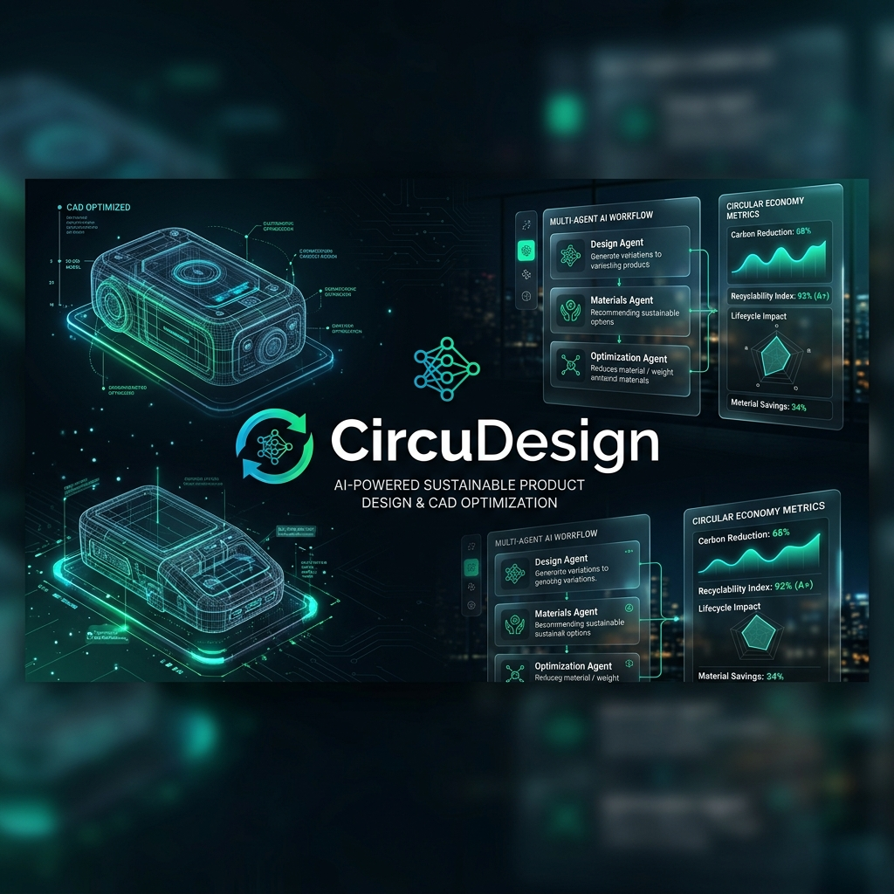
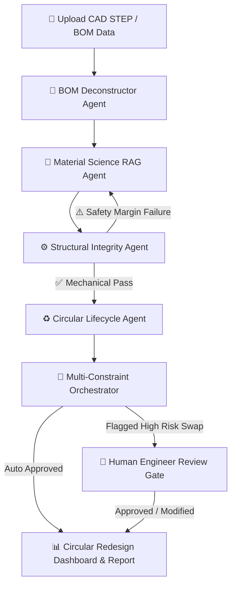

<div align="center">

# ♻️ CircuDesign

### **AI-Powered CAD & BOM Circular Economy Redesign Platform**

[](https://react.dev/)
[](https://www.typescriptlang.org/)
[](https://vitejs.dev/)
[](https://ai.google.dev/)
[](https://threejs.org/)
[](https://tailwindcss.com/)
[](LICENSE)

<br />



<br />
<br />

**CircuDesign** is an intelligent, multi-agent AI engineering workbench designed to transform traditional hardware product development. By combining **3D CAD STEP file parsing**, **Retrieval-Augmented Generation (RAG) material science intelligence**, and **multi-constraint structural validation**, CircuDesign enables engineering teams to autonomously audit, optimize, and redesign products for the **circular economy**—drastically reducing carbon footprints without compromising structural integrity.

</div>

---

## 🌟 Key Features

- **🤖 5-Agent Autonomous Orchestration Engine**:
  - **BOM Deconstructor Agent**: Parses structural hardware assemblies, categorizing fasteners, enclosures, PCBs, and thermal elements.
  - **Material Science RAG Agent**: Searches curated material databases and bio-based material alternatives to substitute high-emission plastics/metals with sustainable options.
  - **Structural Integrity Agent**: Validates proposed material swaps against required yield strengths and safety factor margins (MPa).
  - **Circular Lifecycle Agent**: Evaluates disassembly times, end-of-life recovery pathways, toxicity index reduction, and net CO₂ savings.
  - **Multi-Constraint Orchestrator**: Coordinates iterative agent loops balancing sustainability, mechanical strength, cost multiplier, and supply chain readiness.

- **📐 Interactive 3D CAD STEP/IGES Viewer**:
  - Powered by WebAssembly (`occt-import-js`) and Three.js / React Three Fiber.
  - Interactive exploded views, individual part highlighting, volume estimation, and real-time mesh rendering directly in the browser.

- **🛡️ Human-in-the-Loop (HITL) Safety Gate**:
  - Automatically flags high-risk material substitutions (e.g., tensile strength drops > 15%) for engineer review and manual override.

- **📊 Comprehensive Eco-Analytics Dashboard**:
  - Real-time carbon reduction KPIs ($kg CO_2 / kg$).
  - Circular economy radar charts (Disassembly Score, Recyclability Index, Toxicity Reduction).
  - One-click PDF/CSV report exports for sustainability compliance and EPD audits.

---

## 🏗️ Multi-Agent Architecture Workflow



---

## 🛠️ Tech Stack

| Domain | Technologies |
| :--- | :--- |
| **Frontend UI** | React 19, TypeScript, Vite 6, Tailwind CSS v4, Lucide Icons, Recharts, Motion (Framer) |
| **3D Engine** | Three.js, React Three Fiber, `@react-three/drei`, WebAssembly (`occt-import-js`) |
| **AI & RAG** | Google Gemini API (`@google/genai`), Material Dataset Matching, Vector / CSV RAG |
| **Backend & Server** | Node.js, Express, `tsx` server runner |
| **Cloud & Auth** | Firebase Auth & Firestore |

---

## 🚀 Quick Start Guide

### 📋 Prerequisites

- **Node.js**: `v18.x` or higher
- **npm** or **bun**: Package manager
- **Gemini API Key**: Obtainable from [Google AI Studio](https://aistudio.google.com/)

---

### 📥 1. Clone & Install Dependencies

```bash
# Clone repository
git clone https://github.com/your-username/CircuDesign.git
cd CircuDesign

# Install dependencies
npm install
```

---

### 🔑 2. Configure Environment Variables

Create a `.env.local` file in the root directory:

```env
# Gemini API Key (Required for Multi-Agent RAG Engine)
GEMINI_API_KEY=your_gemini_api_key_here

# Firebase Configuration (Optional for Cloud Persistence)
VITE_FIREBASE_API_KEY=your_firebase_api_key
VITE_FIREBASE_AUTH_DOMAIN=your_project.firebaseapp.com
VITE_FIREBASE_PROJECT_ID=your_project_id
VITE_FIREBASE_STORAGE_BUCKET=your_project.appspot.com
VITE_FIREBASE_MESSAGING_SENDER_ID=your_sender_id
VITE_FIREBASE_APP_ID=your_app_id
```

---

### 🏃 3. Run Development Server

```bash
npm run dev
```

The application and Express backend will launch at **`http://localhost:3000`**.

---

### 📦 4. Build for Production

```bash
# Build Vite client & bundle Express server
npm run build

# Start production server
npm start
```

---

## 📂 Project Structure

```
CircuDesign/
├── assets/
│   └── hero-banner.png         # High-resolution README banner image
├── src/
│   ├── cad/                    # STEP parser & Three.js 3D viewport canvas
│   ├── components/             # Dashboard, Agent Logs, HITL Gate, Metrics Charts
│   ├── context/                # Auth & App State providers
│   ├── data/                   # Material dataset CSV & RAG datasets
│   ├── lib/                    # Gemini API & Firebase integrations
│   ├── server/                 # Express backend API endpoints
│   ├── types.ts                # TypeScript type definitions for BOM, Agents & CAD
│   └── App.tsx                 # Core layout & tab routing
├── materials_dataset.csv       # Curated eco-materials database
├── server.ts                   # Express server entry point
├── package.json
└── README.md
```

---

## 📡 API Endpoints

- **`GET /api/health`**: Healthcheck endpoint returning server status & Gemini connection state.
- **`POST /api/analyze-bom`**: Initiates multi-agent BOM deconstruction and material RAG pipeline.

---

## 📄 License

Distributed under the **MIT License**. See `LICENSE` for more details.

---

<div align="center">

Made with ❤️ for Sustainable Engineering & Circular Economy Innovation.

</div>
